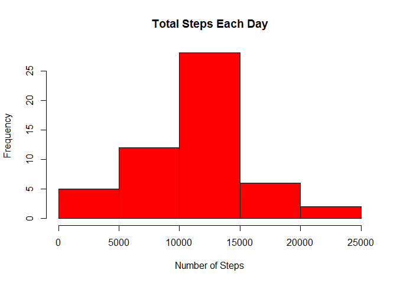
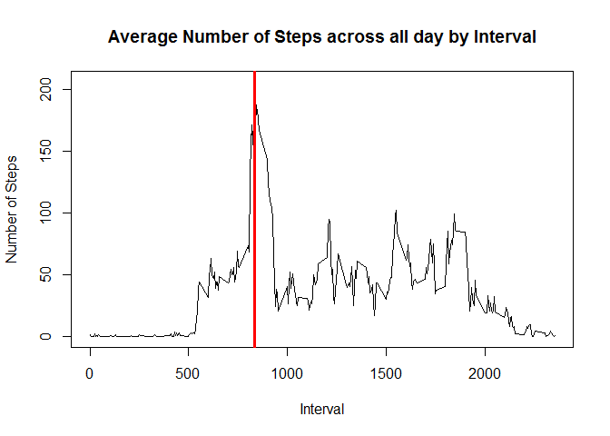
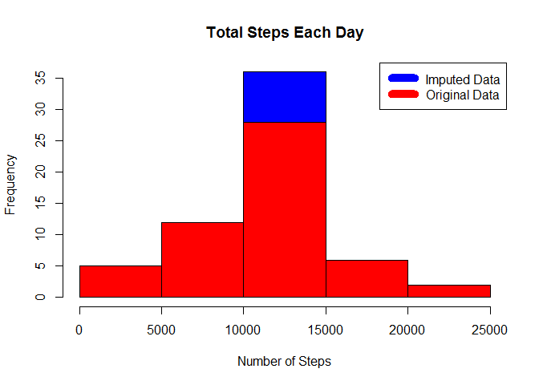
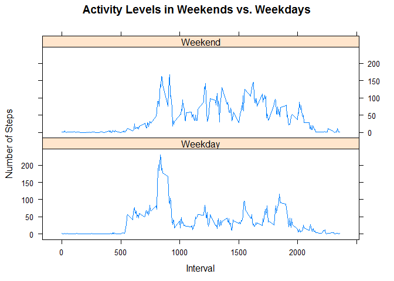

# Reproducible Research: Activity Monitoring Dataset

###Introduction
This is an **analysis of the Activity Monitoring dataset** provided by the **Reproducible Research** Coursera course offered by the John Hopkins Bloomberg Schools of Public Health. This dataset measures daily activity levels and was obtained from a personal device utilized by a single anonymous individual collected during the months of October and November of 2012. This data was collected at 5 minute intervals through out the day and includes the number of steps taken during each of these intervals. 


##Scope
The scope of this project is to analyse on the

1. Mean total number of steps taken per day.
2. Average daily activity pattern.
3. Impact of missing values .
4. Differences in activity patterns between weekdays and weekends.

## Data
The data for this assignment was downloaded from the course web site:

* Dataset: [Activity monitoring data](https://d396qusza40orc.cloudfront.net/repdata%2Fdata%2Factivity.zip) [52K]

The variables included in this dataset are:

* **steps**: Number of steps taking in a 5-minute interval (missing
    values are coded as `NA`)

* **date**: The date on which the measurement was taken in YYYY-MM-DD
    format

* **interval**: Identifier for the 5-minute interval in which
    measurement was taken

The dataset is stored in a comma-separated-value (CSV) file and there are a total of 17,568 observations in this dataset.

## Loading and preprocessing the data

* Download zip file
* Unzip file 
* Load data into data frame `data`.
* Get clean data by omitting NA records

```r
if(!file.exists("activitydataset.zip")) {
        temp <- tempfile()
        download.file("http://d396qusza40orc.cloudfront.net/repdata%2Fdata%2Factivity.zip",temp)
        unzip(temp)
        unlink(temp)
}

data <- read.csv("activity.csv")
cleandata<- na.omit(data)
head(cleandata)
```

```
##     steps       date interval
## 289     0 2012-10-02        0
## 290     0 2012-10-02        5
## 291     0 2012-10-02       10
## 292     0 2012-10-02       15
## 293     0 2012-10-02       20
## 294     0 2012-10-02       25
```


## Mean total number of steps taken per day
* Sum steps by day.
* Create Histogram.
* Calculate mean and median.

```r
tot_steps_by_day <- aggregate(steps ~ date, cleandata, sum)
hist(tot_steps_by_day$steps, main = paste("Total Steps Each Day"), 
     col="red", xlab="Number of Steps")
```

 

```r
options("scipen" = 100, "digits" = 2) # avoid printing output in exponential notation
rmean <- mean(tot_steps_by_day$steps)
rmedian <- median(tot_steps_by_day$steps)
```

The original dataset **mean** is **10766.19** and the **median** is **10765**.

## Average daily activity pattern

* Calculate average steps for each interval for all days. 
* Plot the Average Number Steps averaged across all days by Interval. 
* Find interval with most average steps. 

```r
steps_by_interval <- aggregate(steps ~ interval, cleandata, mean)

plot(steps_by_interval$interval,steps_by_interval$steps, type="l", 
     xlab="Interval", ylab="Number of Steps",
     main="Average Number of Steps across all day by Interval")

max_interval <- steps_by_interval[which.max(steps_by_interval$steps),1]
abline(v = max_interval, col = "red", lwd = 3)
```

 

The **interval at maximum number of steps** recorded is **835** .


## Impute missing values and impact of imputed with original data.
* Create a new dataset that is equal to the original dataset but with the missing data filled in. 
* Strategy for filling in all of the missing values in the dataset
    - Missing values were imputed by inserting the average for each interval. 
    - Say, if interval 10 was missing on 10-02-2012, the average for that interval for all days (0.1320755) is inserted in place of NA. 

```r
incomplete <- sum(!complete.cases(data))
data.i <- transform(data, steps = ifelse(is.na(data$steps), steps_by_interval$steps[match(data$interval, steps_by_interval$interval)], data$steps))
```

The **total number of missing values** in the dataset **2304**.

* Recount total steps by day and create overlapped Histogram with new imputed and original datasets to show differnces. 

```r
tot_steps_by_day_i <- aggregate(steps ~ date, data.i, sum)
hist(tot_steps_by_day_i$steps, main = paste("Total Steps Each Day"), 
     col="blue", xlab="Number of Steps")

#Create Histogram to show difference. 
hist(tot_steps_by_day$steps, main = paste("Total Steps Each Day"), 
     col="red", xlab="Number of Steps", add=T)
legend("topright", c("Imputed Data", "Original Data"), 
       col=c("blue", "red"), lwd=10)
```

 

* Calculate new mean and median for imputed data. 

```r
rmean.i <- mean(tot_steps_by_day_i$steps)
rmedian.i <- median(tot_steps_by_day_i$steps)
```
The imputed dataset **mean** is **10766.19** and the **median** is **10766.19**.

* Combine mean and median of imputed data and Original data for comparative study. 

```r
comptable <- matrix(c(rmean, rmedian, rmean.i, rmedian.i), ncol=2)
rownames(comptable) <- c("Mean", "Median")
colnames(comptable) <- c("Original Data", "Imputed Data")
```
 
 **Comparison Report of Mean and Median of imputed and original data** 

```r
comptable
```

```
##        Original Data Imputed Data
## Mean           10766        10766
## Median         10765        10766
```

**Differences of imputed data with original data**

* Calculate difference between imputed and Original data.

```r
mean_diff <- rmean.i - rmean
med_diff <- rmedian.i - rmedian
```

- The difference between the original mean and imputed mean is 0
- The difference between the original median and imputed median is 1.19

 **Impact of imputed data over original data in terms number of steps**
 
 * Calculate the difference in the toal number of steps.

```r
total_diff <- sum(tot_steps_by_day_i$steps) - sum(tot_steps_by_day$steps)
```
 
- Impact of imputing missing data on the estimates of the total daily number of steps between imputed and original data is 86129.51. 


## Differences in activity patterns between weekdays and weekends
* Prepare the data by factorising data to weekday or weekend 

```r
weekdays <- c("Monday", "Tuesday", "Wednesday", "Thursday","Friday")
data.i$wday = as.factor(ifelse(is.element(weekdays(as.Date(data.i$date)),weekdays),"Weekday", "Weekend"))
table(data.i$wday)
```

```
## 
## Weekday Weekend 
##   12960    4608
```
 
* Create a panel plot for comparison of number of steps between the weekend and weekdays.

```r
steps_by_interval_i <- aggregate(steps ~ interval + wday, data.i, mean)

library(lattice)

xyplot(steps_by_interval_i$steps ~ steps_by_interval_i$interval|steps_by_interval_i$wday,
       main="Activity Levels in Weekends vs. Weekdays" ,
       xlab="Interval", ylab="Number of Steps",layout=c(1,2), type="l")
```

 

 **During Weekends activity is almost uniform in all time intervals comparing to weekdays, where more activities are in earlier time interval.**
